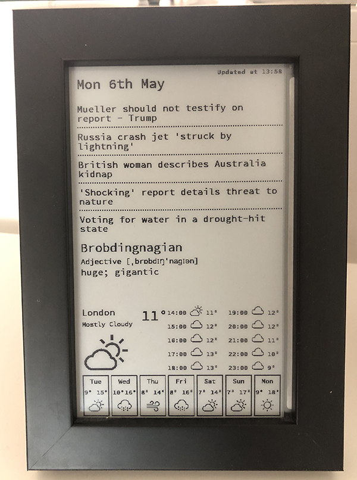

# paper-pi

This project generates a bitmap image displaying relevant daily infomation such as news, weather and a word of the day.

This image is displayed on a device of my own creation which I call a 'Paper Pi'. Named due to it's use of a Raspberry Pi and an e-paper screen.

More details can be found here: [E-Ink Display for Daily News, Weather and More](https://www.hackster.io/lukehaas/e-ink-display-for-daily-news-weather-and-more-3dd7b1)

